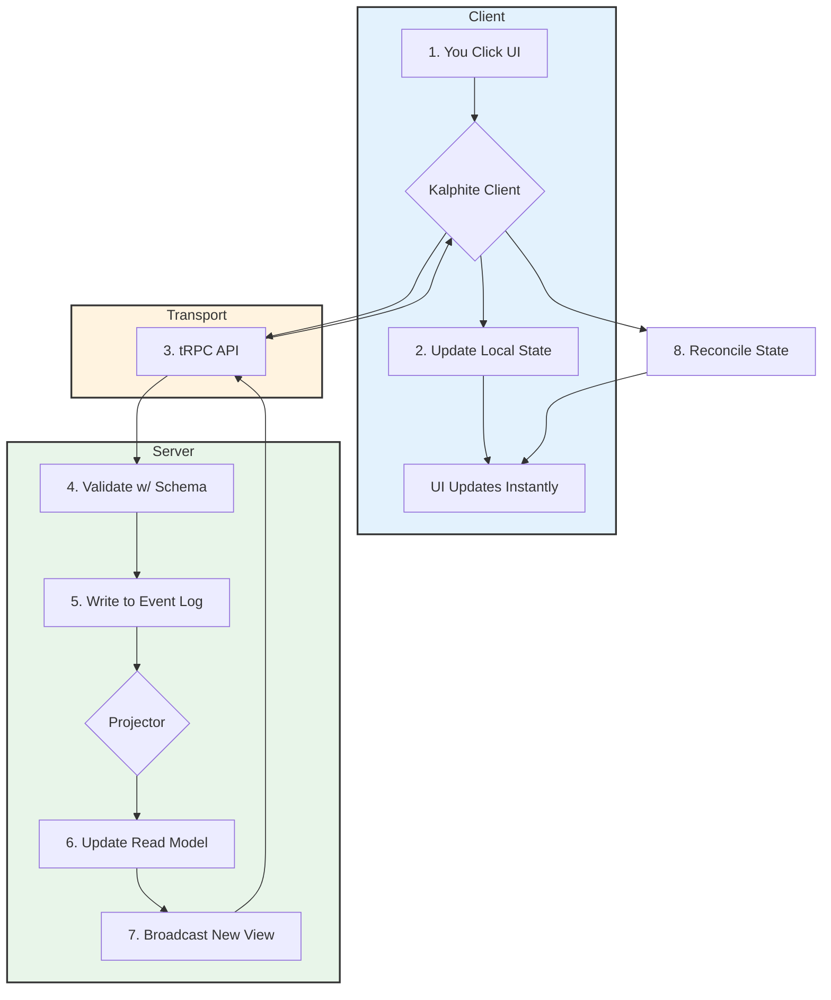

# How Kalphite Works

A simple guide to understanding the Kalphite system architecture.

## Parts List

| Part                | Icon | Description                                                            |
| :------------------ | :--- | :--------------------------------------------------------------------- |
| **UI**              | 🖼️   | What you see and click.                                                |
| **Local State**     | 📝   | Your browser's temporary memory. Makes UI feel instant.                |
| **Kalphite Client** | 🚀   | The library in your browser managing the 📝 and talking to the server. |
| **API Transport**   | 🔗   | The type-safe connection to the server (tRPC).                         |
| **Server**          | ☁️   | The central system.                                                    |
| **Event Log**       | 📖   | The server's permanent, master instruction book. The source of truth.  |
| **Read Model**      | 🗂️   | The server's fast, queryable "card catalog" built from the 📖.         |
| **Projector**       | ⚙️   | A server machine that reads the 📖 to build the 🗂️.                    |
| **Shared Schema**   | 📏   | The master blueprint (Zod) ensuring all data fits together perfectly.  |

## How It Works

### 1. You Click

- You interact with the 🖼️ UI.
- The 🚀 **Kalphite Client** writes a temporary change to the 📝 **Local State**. The 🖼️ **UI** updates instantly.

### 2. Client Sends

- The 🚀 **Kalphite Client** sends the change to the ☁️ **Server** through the 🔗 **API Transport**.

### 3. Server Validates & Records

- The ☁️ **Server** uses the 📏 **Shared Schema** to check if the change is valid.
- If valid, it writes the change into the 📖 **Event Log**.

### 4. Server Builds View

- The ⚙️ **Projector** sees the new event in the 📖 **Event Log**.
- It updates the 🗂️ **Read Model** accordingly.

### 5. Server Broadcasts

- The ☁️ **Server** queries the updated 🗂️ **Read Model**.
- It sends the new, correct view back to all connected clients via the 🔗 **API Transport**.

### 6. Client Reconciles

- The 🚀 **Kalphite Client** receives the final view from the server.
- It replaces the temporary change in the 📝 **Local State** with the final version. The 🖼️ **UI** is now confirmed and stable.

## System Flow Diagram

## Key Benefits

- **Instant UI**: Local state updates make interactions feel immediate
- **Type Safety**: Shared schemas prevent data mismatches
- **Reliability**: Event log provides perfect audit trail and debugging
- **Performance**: Read model enables fast queries
- **Collaboration**: Real-time updates keep everyone in sync
